# IDS706_University Rankings Exploration

## Connect to database
Use DBeaver to connect to the SQLite database.
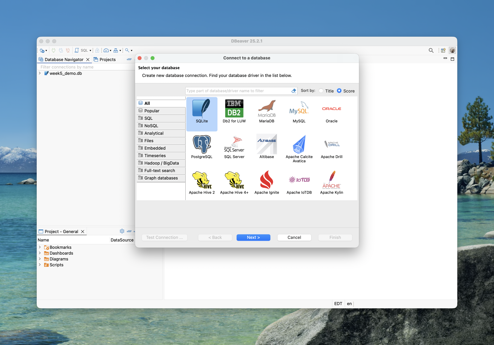
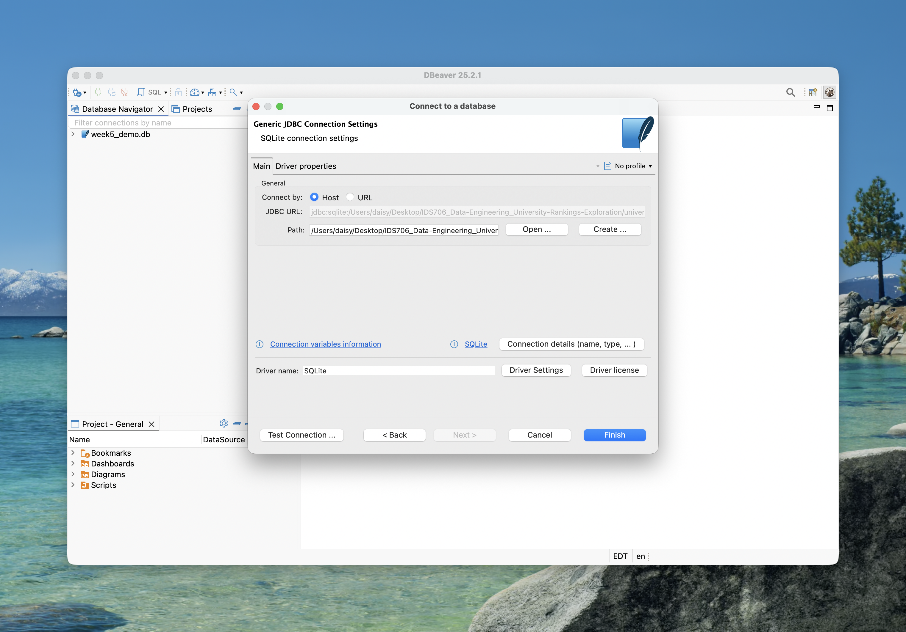
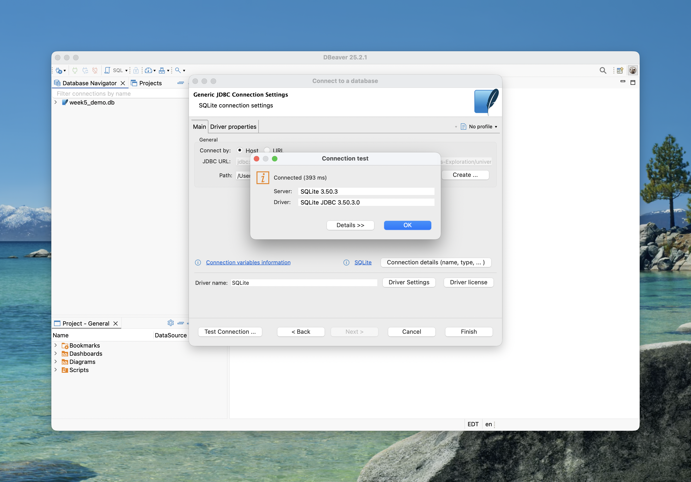

### Dataset & Schema
Table: **university_rankings**

| column               | type    | meaning |
| -------------------- | ------- | -----------------------------|
| world_rank           | INTEGER | Global overall rank |
| institution          | TEXT    | University name |
| country              | TEXT    | Country / Region |
| national_rank        | INTEGER | Rank within the country |
| quality_of_education | INTEGER | Rank in education quality |
| alumni_employment    | INTEGER | Rank in alumni employment   |
| quality_of_faculty   | INTEGER | Rank in faculty quality |
| publications         | INTEGER | Rank in research output |
| influence            | INTEGER | Rank in influence |
| citations            | INTEGER | Rank in citation count |
| broad_impact         | INTEGER | Rank in broad impact  |
| patents              | INTEGER | Rank in number of patents |
| score                | REAL    | Composite score |
| year                 | INTEGER | Reporting year |

## Perform Basic Analysis
### Data boundaries
First, to better understand the data structure, I examine the data boundaries of key variables in the dataset.

**1. broad_impact**

When I glance at the data, I notice that there are many null values among `broad_impact`. Therefore, I examine the distribution and boundaries of it.
```
select max(broad_impact) as broad_impact_max
,min(broad_impact) as broad_impact_min
,count(*) as total_count
,sum(case when broad_impact = '' then 1 else 0 end) as null_count
,round(100.0 * sum(case when broad_impact = '' then 1 else 0 end) / count(*), 2) AS null_percentage
from university_rankings;
```
Approximately 10% of records contain null values in `broad_impact`, which is within acceptable limits but should be handled appropriately in subsequent analysis.
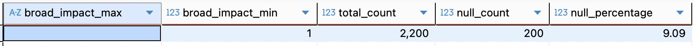

**2. ranks**

To understand the data structure across different years, I examine the maximum values of key ranking variables by year.
```
select year
,max(world_rank) as max_world
,max(quality_of_education) as max_edu
,max(alumni_employment) as max_alu
,max(quality_of_faculty) as max_fac
,max(publications) as max_pub
,max(influence) as max_inf
,max(citations) as max_cit
,max(patents) as max_pat
from university_rankings 
group by 1
order by 1;
```
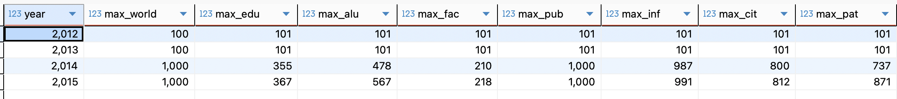
Key Findings:

- Significant scale change between 2013 and 2014:
    - Dataset expanded from 100 universities to 1,000 universities
    - All ranking metrics show substantial boundary increases

- Variable-specific boundaries differ:
    - quality_of_faculty has the smallest range (max: 210-218)
    - world_rank and publications have the largest range (max: 1,000)

- This inconsistency has critical implications for subsequent analysis:
    - Direct cross-year comparisons of absolute rankings are not valid, especially across the 2013/2014 boundary. All downstream analyses should filter by specific years using conditions like `where year = 2015` and avoid comparing rankings across years without normalization.
    - For temporal trend analysis, consider using percentile-based rankings or standardization methods to enable meaningful cross-year comparisons.

### Data Distribution

**1. Top 20 Countries by Number of Universities (2015)**

I identify the countries with the most universities in 2015 to analyze geographic representation and coverage patterns.

```
select country, count(*) as cnt
from university_rankings
where year = 2015
group by 1
order by 2 desc
limit 20;
```
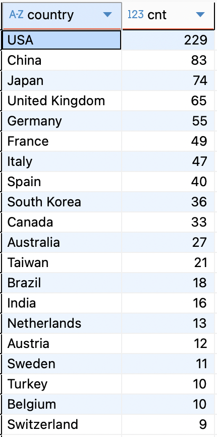

**2. Top 5 National Universities in the 10 Best-Performing Countries (2015)**

To identify leading institutions in countries with strong overall higher education systems, I first determine the 10 countries with the highest average university scores in 2015, then retrieve the top 5 nationally-ranked universities within each of these countries.

```
with top_countries as (
	select country, round(avg(score),2) as score_avg
	from university_rankings
	where year = 2015
	group by 1
	order by avg(score) desc 
	limit 10
)
,ranked_universities as(
	select t1.country, t2.score_avg, institution, national_rank, score, year
	,dense_rank() over(partition by t1.country order by national_rank) as rank_ds
	from university_rankings t1
	inner join top_countries t2
	on t1.country = t2.country
	where year = 2015
);

select country, score_avg, institution, national_rank, score, year
from ranked_universities
where rank_ds <= 5 
order by score_avg desc;
```
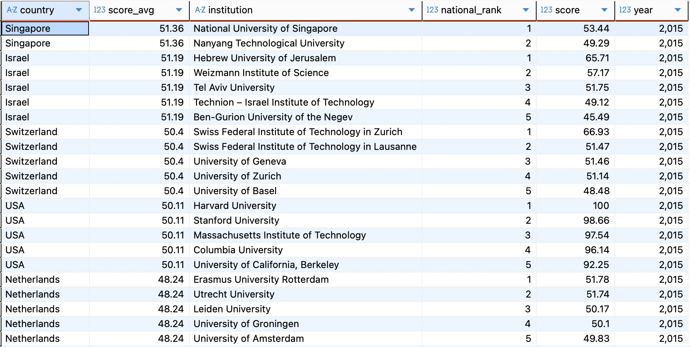
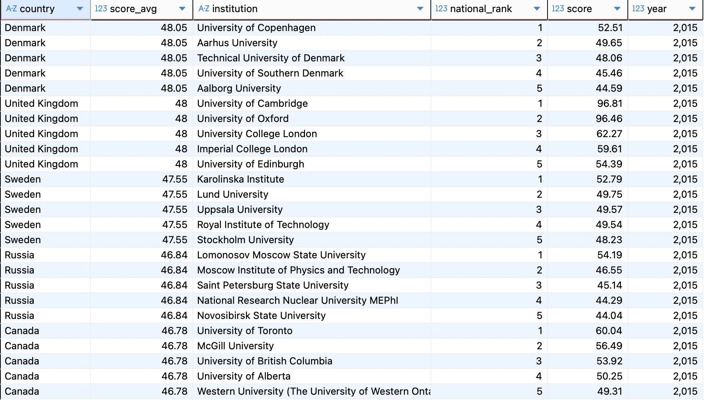

## CRUD Operations

### Create
Q: The ranking committee has decided to publish new results for a new university in 2014. Insert this university into the database.

- Institution: Duke Tech

- Country: USA

- World Rank: 350

- Score: 60.5

```
insert into university_rankings (institution, country, world_rank, score, year)
values ('Duke Tech', 'USA', 350, 60.5, 2014);
```
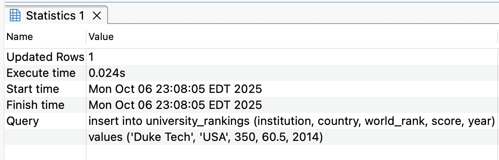
A line was inserted as follows:
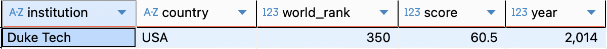

### Read
Q: A policy consultant has reached out to you with the following question. How many universities from Japan show up in the global top 200 in 2013?
```
select count(*) as cnt
from university_rankings
where country = 'Japan'
  and year = 2013
  and world_rank <= 200;
```
6 universities (Based on the dataset structure identified earlier, the 2013 data only includes universities ranked 1-100. Therefore, counting universities in the "top 200" for 2013 is equivalent to counting those in the top 100).
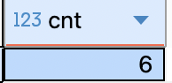

### Update
Q: The score for University of Oxford in 2014 was miscalculated. Increase its score by +1.2 points. Update the row to reflect this update.
```
update university_rankings
set score = score + 1.2
where institution = 'University of Oxford'
  and year = 2014;
```
One row has been updated as follows:
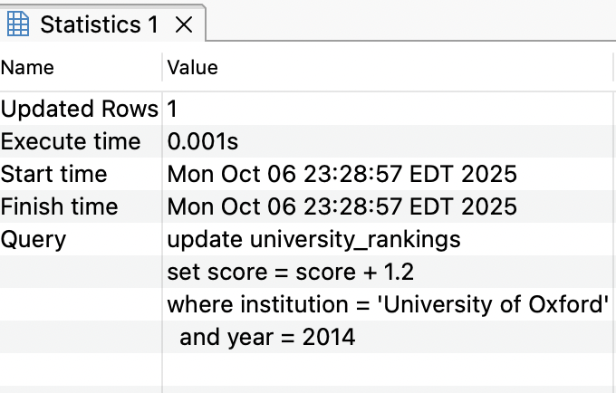
Before:
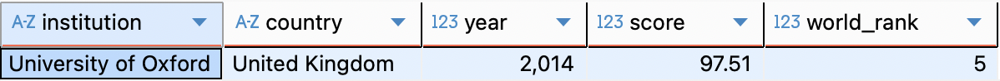
After:
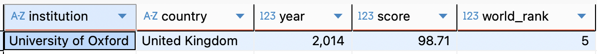

### Delete
Q: After reviewing, the ranking committee decided that universities with a score below 45 in 2015 should not have been included in the published dataset. Clean up the records to reflect this.

- Check before deletion
```
select count(*) as total,
    count(case when score < 45  then 1 end) as delet,
    count(case when score >= 45 then 1 end) as remain
from university_rankings
where year = 2015;
```
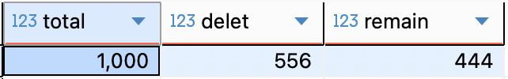

```
select year, institution, score
from university_rankings
where year = 2015
  and score < 45;
```
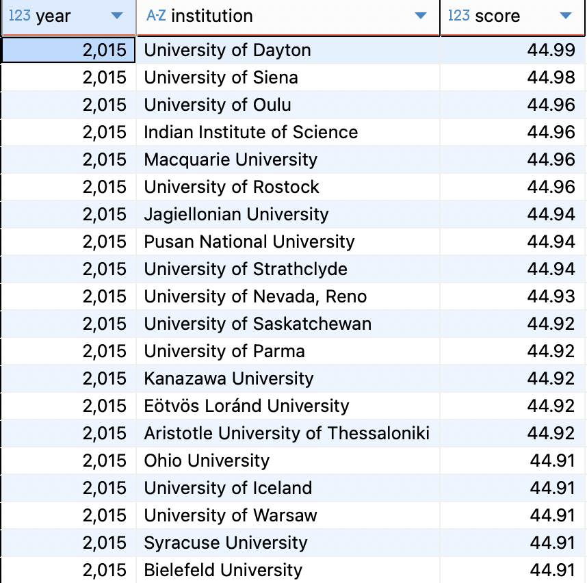

- Delete
```
delete from university_rankings
where year = 2015
  and score < 45;
```
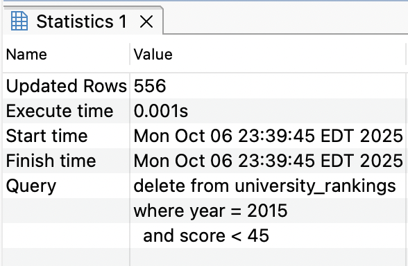

- Check after deletion
```
select count(*) 
from university_rankings 
where year = 2015;
```
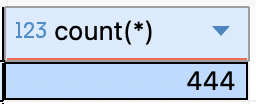

```
select year, institution, score
from university_rankings
where year = 2015
  and institution = 'University of Dayton';
```
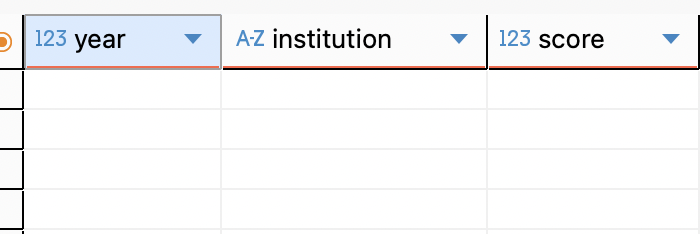